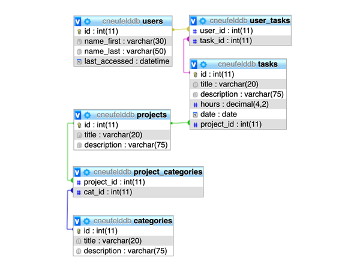

# TimeHub
Timekeeping for personal and collaborative projects.

The focus for this app is tracking one-time, singular occurrences of completed tasks in order to calculate statistics for cumulative hours of tasks within different user-defined projects.

## Getting Started

### Prerequisites

It is necessary for the user to have access to a database with a MySQL relational database management system like MariaDB.

Login customization provided to the user to enter:

* Database Host (e.g., php.myadmin.ca)
* Database Codename
* Database User
* Database Password

This information can be reset from the File menu item: Change Database.

## Running the TimeHub app

### Creation of the Database

When a user logs in, a database connection is created and tables are created on this database.

*Figure 1. SQL Table Structure*

### Tasks

The user defines a task with hours. The user may also provide this task with an optional description.

### Projects

The user defines a project name.

### Categories

The user defines a category name.

## Statistics

A pie chart is provided to the user that displays proportional data of cumulative task hours according to the corresponding slice of pie for each project.

## Built With

* Eclipse IDE for Java Developers - Version: 24.12.0
* IntelliJ IDEA Community Edition - Version: 11.0.4
* Adobe Illustrator - Version 23.0.4
* Adobe Photoshop CC 2019 - Version 20.0.5
* GitHub

## Authors: HAC Programming

* **H**asan Muslemani
* **A**bel Anderson
* **C**ordelle Neufeld

## Acknowledgments

This app was built as a final project for Java 3 in the [Mobile Applications Development Program](http://www.stclaircollege.ca/programs/postsec/mobile_app_dev/) at St. Clair College in Windsor, Ontario, Canada. We are appreciative of the support and guidance of Câi Filiault, Professor.

Vector images sourced and modified from [Vecteezy.com](https://www.vecteezy.com)
